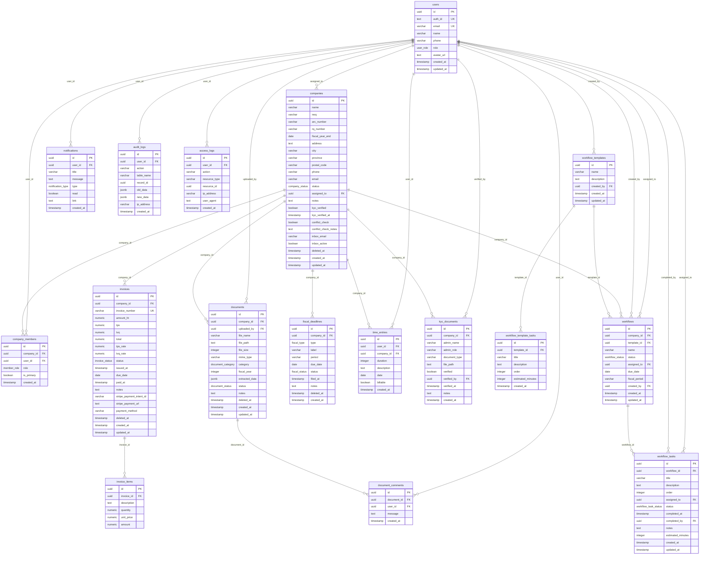
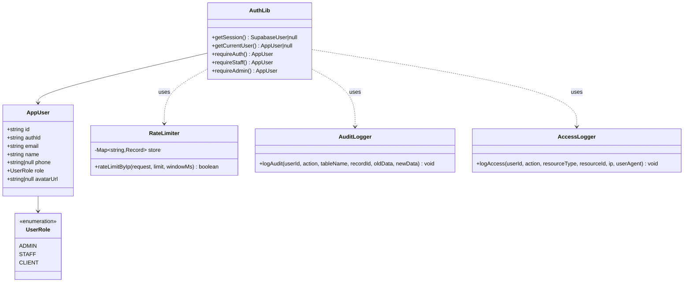
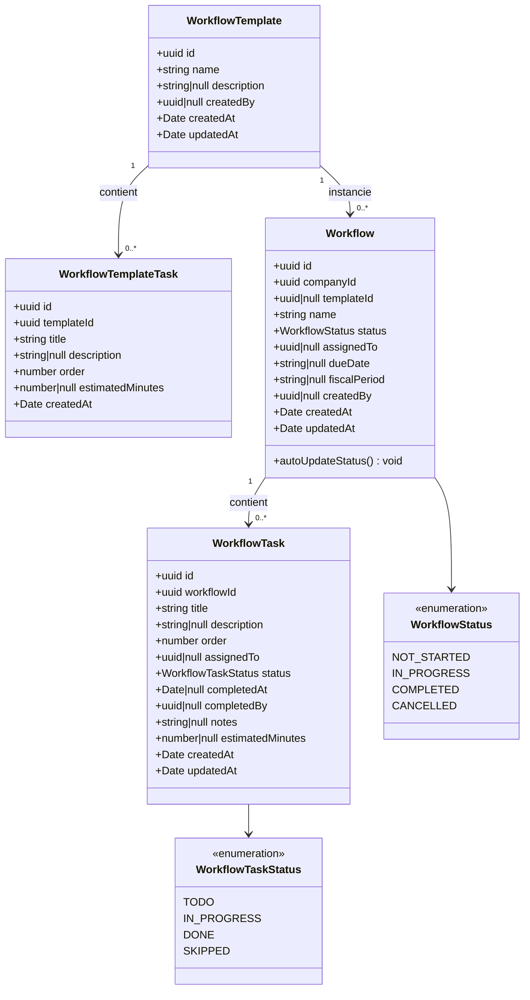
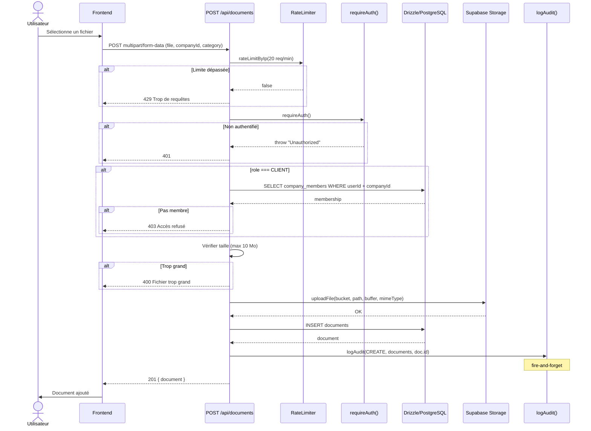
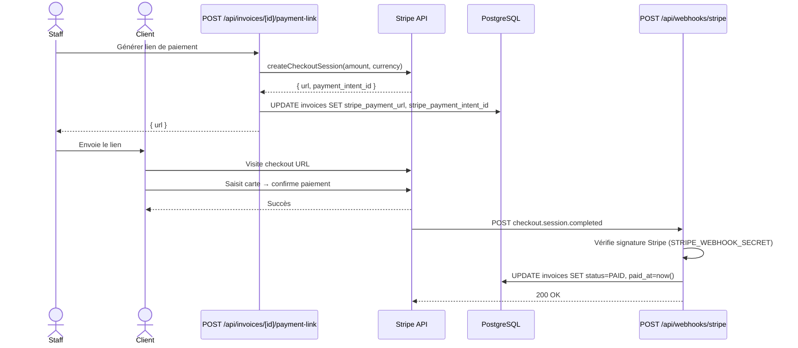
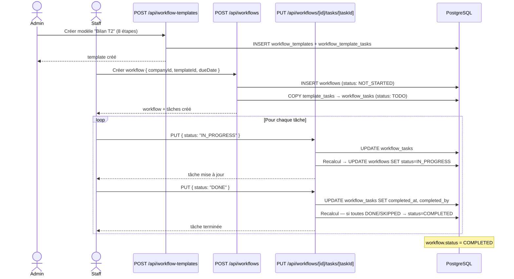
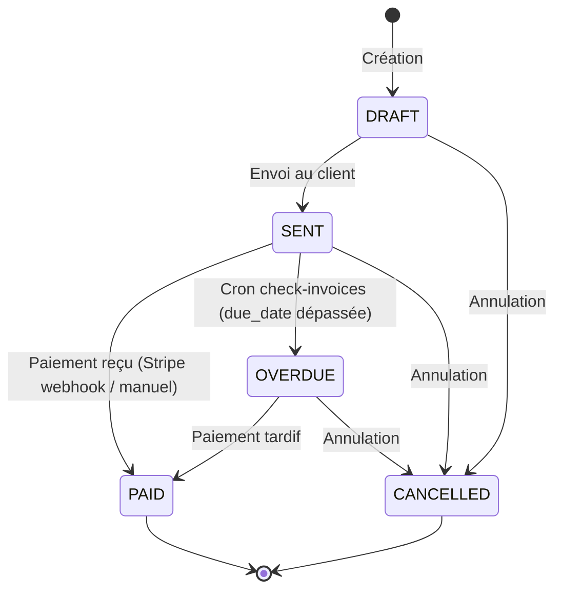
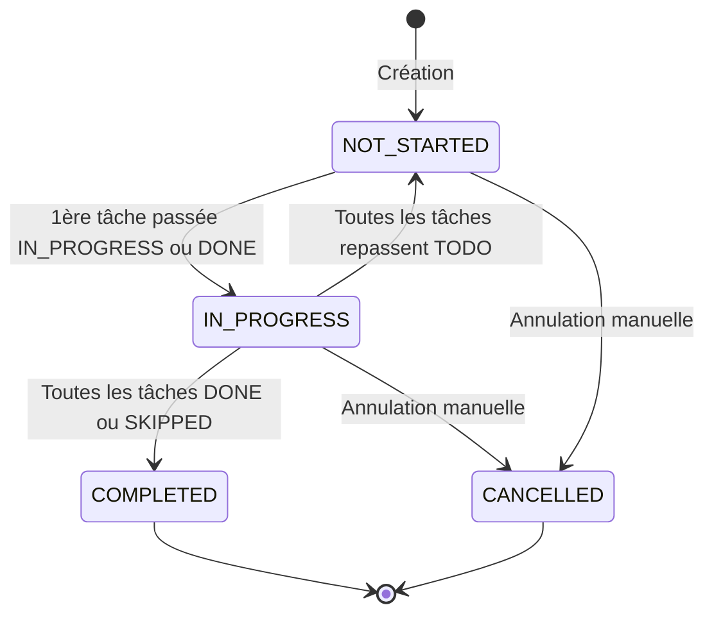
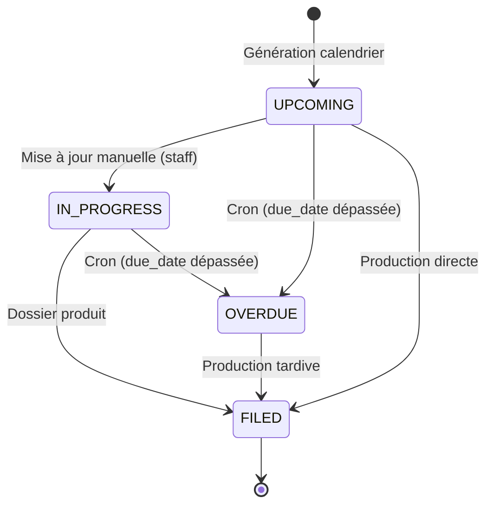
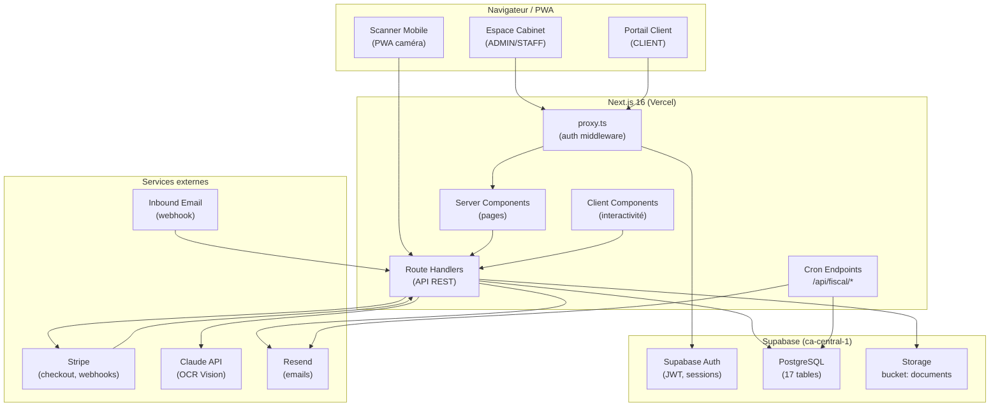

# CabiCompta — Diagrammes UML

> Rendu : VS Code (extension Mermaid), GitHub, ou https://mermaid.live

---

## 1. Diagramme Entité-Relation (ER)

---

## 2. Diagramme de classes — Couche Auth

---

## 3. Diagramme de classes — Workflows

---

## 4. Diagramme de séquence — Upload document

---

## 5. Diagramme de séquence — Paiement Stripe

---

## 6. Diagramme de séquence — Workflow (cycle de vie)

---

## 7. Diagramme d'état — Facture

---

## 8. Diagramme d'état — Workflow

---

## 9. Diagramme d'état — Échéance fiscale

---

## 10. Diagramme de composants — Architecture globale

